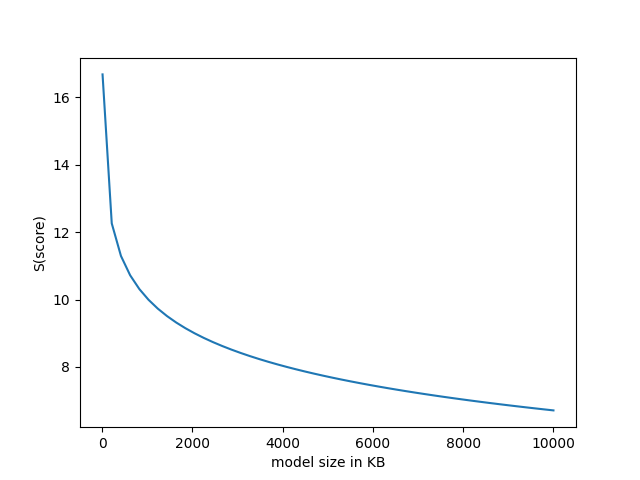

# fault-intelligent-diagnosis

## 07.14

在保证模型在验证集上的F1达到0.99的情况下，降低CNN模型大小。

### 模型大小

|  模型  |  大小  |
|  :----:  | :----:  |
|  CNN  |  17.3 MB  |
|  SmallerNet  |  532 KB |
|  SmallestNet  | 205 KB |

### 07.15可改进方向

#### 1. full dataset Train

当前是将原始训练集分为训练集：验证集（9:1），在正式提交的时候可以直接使用全部原始数据集进行训练。

#### 2. 改变模型保存的默认参数浮点数，查看模型性能变化情况

模型默认的参数浮点数是torch.float32，可以改为torch.float16，这样可以降低模型一半大小。

#### 3. 获得不同模型的预测结果差异情况

#### 4. 获得model size和score之间的对应关系

CUDA_VISIBLE_DEVICES=2,3 python CNN_fulltrain.py --lr 0.01 --name CNN_0.01

scp -P 19000 ms1@120.92.17.23:/mnt/mxy/linchungang/image_diagnosis/full_train/float32/CNN.pth /Users/cglin/Desktop/CNN/fulltrain/float32/CNN/

CUDA_VISIBLE_DEVICES=2,3 python small_CNN_fulltrain.py --lr 0.01 --name CNN_0.01

scp -P 19000 ms1@120.92.17.23:/mnt/mxy/linchungang/image_diagnosis/full_train/float32/SmallerNet.pth /Users/cglin/Desktop/CNN/fulltrain/float32/SmallerNet/

CUDA_VISIBLE_DEVICES=2,3 python smallest_CNN_fulltrain.py --lr 0.01 --name CNN_0.01

scp -P 19000 ms1@120.92.17.23:/mnt/mxy/linchungang/image_diagnosis/full_train/float32/SmallestNet.pth /Users/cglin/Desktop/CNN/fulltrain/float32/SmallestNet/

CUDA_VISIBLE_DEVICES=2,3 python CNN_fulltrain_float16.py --lr 0.01 --name CNN_0.01

scp -P 19000 ms1@120.92.17.23:/mnt/mxy/linchungang/image_diagnosis/full_train/float16/CNN_16.pth /Users/cglin/Desktop/CNN/fulltrain/float16/CNN/

CUDA_VISIBLE_DEVICES=2,3 python medium_CNN_fulltrain.py --lr 0.01 --name CNN_0.01

scp -P 19000 ms1@120.92.17.23:/mnt/mxy/linchungang/image_diagnosis/full_train/float32/medium_CNN.pth /Users/cglin/Desktop/CNN/fulltrain/float32/medium_CNN/

CUDA_VISIBLE_DEVICES=2,3 python medium_CNN_fulltrain_float16.py --lr 0.01 --name CNN_0.01

scp -P 19000 ms1@120.92.17.23:/mnt/mxy/linchungang/image_diagnosis/full_train/float16/medium_CNN_16.pth /Users/cglin/Desktop/CNN/fulltrain/float16/medium_CNN/

CUDA_VISIBLE_DEVICES=2,3 python multi_modal_CNN.py --lr 0.01 --name CNN_0.01